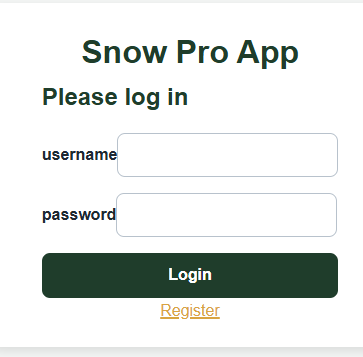
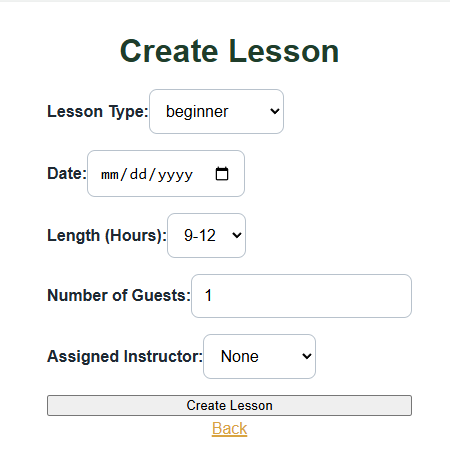
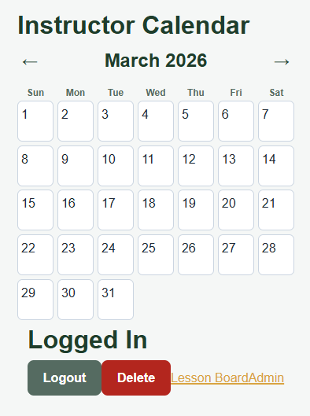

# Ski Lessons Scheduler

Full-stack MERN application for managing ski lesson bookings with role-based access for admins and instructors.

## Features

- JWT authentication with server-side token revocation support.
- Role-based access control for admin-only operations.
- Lesson calendar views for available lessons and assigned lessons.
- Admin lesson creation flow with input validation.
- MongoDB data model with indexed lesson/user collections.
- Migration tooling for legacy lesson data (`date` and `assignedTo` normalization).

## Tech Stack

| Layer | Technology |
| --- | --- |
| Frontend | React 19, Vite, React Router |
| Backend | Node.js, Express, Nodemon |
| Database | MongoDB with Mongoose |
| Auth | JSON Web Tokens (JWT) |
| Styling | SCSS + CSS modules/partials |
| Testing | Vitest |

## Repository Structure

```text
client/
  src/
    components/
    pages/
    utils/
    scss/
    styles/

server/
  controllers/
  middleware/
  models/
  routes/
  utilities/
  scripts/
  email/
```

## Quick Start

### Prerequisites

- Node.js 22.x (matches `engines.node`)
- npm
- MongoDB instance

### Install

```bash
# from project root
npm install

cd server
npm install

cd ../client
npm install
```

### Environment Variables

Create `server/config/.env` with:

```env
PORT=2000
URI=mongodb://localhost:27017/
JWT_SECRET=your_jwt_secret
APP_PASSWORD=your_email_app_password
SMTP_USER=you@example.com
NODE_ENV=development
```

### Run Development Servers

Terminal 1 (backend):

```bash
cd server
npm run dev
```

Terminal 2 (frontend):

```bash
cd client
npm run dev
```

Frontend runs on Vite default (`http://localhost:5173`) and calls backend API routes mounted at `/api`.

## Scripts

Root (`package.json`):

- `npm run build` builds client
- `npm run test` runs Vitest
- `npm run start` starts `server/index.js`

Server (`server/package.json`):

- `npm run dev` starts nodemon
- `npm run start` starts node server
- `npm run test` runs server Vitest tests
- `npm run migrate:lessons` migrates legacy lesson records

Client (`client/package.json`):

- `npm run dev` starts Vite
- `npm run build` creates production build
- `npm run test` runs client Vitest tests

## API Overview

All endpoints are mounted under `/api`.

| Method | Endpoint | Access | Description |
| --- | --- | --- | --- |
| POST | `/api/register` | Public | Register user (always non-admin) |
| POST | `/api/login` | Public | Login and receive JWT |
| POST | `/api/logout` | Authenticated | Revoke token |
| DELETE | `/api/self-delete` | Authenticated | Delete current user and unassign lessons |
| GET | `/api/is-admin` | Authenticated | Return decoded user credentials |
| GET | `/api/lessons` | Authenticated | Retrieve lessons (`available: true` header for unassigned lessons) |
| POST | `/api/create-lesson` | Admin | Create lesson |
| PATCH | `/api/lessons/:lessonId/assign` | Authenticated | Assign lesson to current user |
| GET | `/api/user-retrieval` | Admin | Retrieve users without passwords |

## Auth and RBAC

- Protected routes require `Authorization: Bearer <token>`.
- Middleware verifies JWT and checks blacklist revocation status.
- `requireAdmin` middleware gates admin-only endpoints.
- Logout persists revoked tokens in `BlacklistedToken` with TTL expiration.

## Data Model (Current)

### User

- `username: String` (unique, indexed)
- `password: String` (hashed)
- `admin: Boolean`
- timestamps (`createdAt`, `updatedAt`)

### Lesson

- `type: String`
- `date: Date` (UTC)
- `timeLength: String`
- `guests: Number`
- `assignedTo: ObjectId | null` (ref `User`)
- timestamps (`createdAt`, `updatedAt`)

### BlacklistedToken

- `token: String` (unique)
- `expiresAt: Date` (TTL index)

## Migration

If you have legacy lessons with string dates or `assignedTo: "None"`, run:

```bash
cd server
npm run migrate:lessons
```

This script converts:

- `date` string -> `Date`
- `assignedTo: "None"` -> `null`
- `assignedTo` ObjectId-like string -> `ObjectId`

## Architecture Flow

Request lifecycle:

1. Route selection in `server/routes/index.js`
2. Middleware execution (`authenticate`, `requireAdmin`, request validation)
3. Controller orchestration (`server/controllers/*.js`)
4. Model/data access (`server/models/*.js`)
5. Utility and schema support (`server/utilities/*.js`)

Frontend/back-end split:

- `client/` handles pages, components, calendar rendering, and user interaction.
- `server/` handles auth, RBAC, validation, persistence, and API responses.

## Screenshots





## License

MIT

