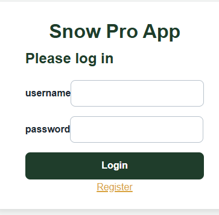
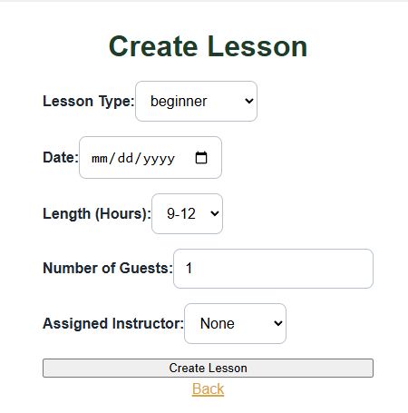
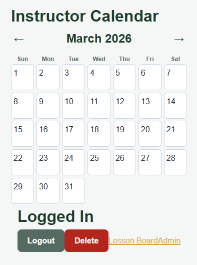

# Ski Lessons Scheduler

Full-stack MERN application for managing ski lesson bookings with role-based access for admins and instructors.

## Features

- JWT authentication with server-side token revocation support.
- Role-based access control for admin-only operations.
- Lesson calendar views for available lessons and assigned lessons.
- Admin lesson creation flow with input validation.
- MongoDB data model with indexed lesson/user collections.
- Migration tooling for legacy lesson data (`date` and `assignedTo` normalization).

## Tech Stack

| Layer | Technology |
| --- | --- |
| Frontend | React 19, Vite, React Router |
| Backend | Node.js, Express, TypeScript, Nodemon |
| Database | MongoDB with Mongoose |
| Auth | JSON Web Tokens (JWT) |
| Styling | SCSS partial architecture |
| Testing | Vitest |

## Repository Structure

```text
client/
  src/
    components/
    pages/
    utils/
    scss/

server/
  src/
    controllers/
    middleware/
    models/
    routes/
    services/
    utilities/
    scripts/
    email/
  dist/
```

## Quick Start

### Prerequisites

- Node.js >= 20 and < 23 (matches `engines.node`)
- npm
- MongoDB instance

### Install

```bash
# from project root
npm install

cd server
npm install

cd ../client
npm install
```

### Environment Variables

Create `server/config/.env` with:

```env
PORT=2000
URI=mongodb://localhost:27017/
JWT_SECRET=your_jwt_secret
APP_PASSWORD=your_email_app_password
SMTP_USER=you@example.com
NODE_ENV=development
LOCAL_ADMIN_USERNAME=your_local_admin_username
LOCAL_ADMIN_PASSWORD=your_strong_local_admin_password
```

If `LOCAL_ADMIN_USERNAME` and `LOCAL_ADMIN_PASSWORD` are not set, the server will skip local admin bootstrap in non-production environments and log a warning instead of relying on hardcoded defaults.

### Operational Notes

- The backend reads environment values from `server/config/.env` at startup.
- The server exposes `GET /health` for quick readiness checks. It returns `200` when MongoDB is reachable and `503` while the database is unavailable.
- If you change backend TypeScript source, rebuild the server before running the compiled entrypoint so `dist/` stays current.
- The server can start in a degraded mode when MongoDB is unavailable, but database-backed routes will fail until the connection is restored.

### Run Development Servers

Terminal 1 (backend):

```bash
cd server
# Required once after TypeScript source changes before running dist output.
npm run build
npm run dev
```

Optional while actively editing backend TypeScript in another terminal:

```bash
cd server
npx tsc -p tsconfig.json --watch
```

Terminal 2 (frontend):

```bash
cd client
npm run dev
```

Frontend runs on Vite default (`http://localhost:5173`) and calls backend API routes mounted at `/api`.

### Local Development Flow

1. Start the backend first so the API is available.
2. Open the frontend in a second terminal to use the React app.
3. Check `http://localhost:2000/health` after startup to confirm the server is responding.
4. If you see stale backend behavior, rerun `npm --prefix server run build` before restarting the server.

## Scripts

Root (`package.json`):

- `npm run build` builds server and client
- `npm run build:server` installs server deps and compiles TypeScript to `server/dist`
- `npm run build:client` installs client deps and builds Vite assets
- `npm run test` runs Vitest
- `npm run test:run` runs Vitest once
- `npm run test:coverage` runs Vitest with coverage
- `npm run start` starts `server/dist/index.js`

## Documentation

- **[API Reference](docs/API.md)** — Complete endpoint reference with request/response examples, status codes, and error handling
- **[Database Schema](docs/DATABASE.md)** — MongoDB collections, indexes, business logic, and query examples
- **[Middleware & Validation](docs/MIDDLEWARE.md)** — Request pipeline, validation flow, and middleware architecture

Server (`server/package.json`):

- `npm run dev` starts nodemon using `dist/index.js`
- `npm run build` compiles TypeScript to `dist`
- `npm run start` starts node server
- `npm run test` runs server Vitest tests
- `npm run migrate:lessons` runs compiled migration at `dist/scripts/migrate-lessons.js`

Client (`client/package.json`):

- `npm run dev` starts Vite
- `npm run build` creates production build
- `npm run typecheck` runs TypeScript checks
- `npm run lint` runs ESLint
- `npm run test` runs client Vitest tests

## Development Workflow

Recommended local workflow:

```bash
# from project root
npm --prefix server run build
npm --prefix server run dev

# in a second terminal
npm --prefix client run dev
```

Recommended validation workflow before pushing:

```bash
npm --prefix client run lint
npm --prefix client run typecheck
npm --prefix client run test -- --run
npm --prefix client run build
npm --prefix server run test -- --run
npm --prefix server run build
```

## API Overview

All endpoints are mounted under `/api`.

| Method | Endpoint | Access | Description |
| --- | --- | --- | --- |
| GET | `/health` | Public | Service readiness check (`200` when DB is ready, `503` when degraded) |
| POST | `/api/auth/register` | Public | Register a user (server always stores `admin: false`) |
| POST | `/api/auth/login` | Public | Login and receive JWT |
| POST | `/api/auth/logout` | Authenticated | Revoke current token |
| GET | `/api/users/me` | Authenticated | Return current decoded user credentials |
| DELETE | `/api/users/me` | Authenticated | Delete current user and unassign their lessons |
| GET | `/api/lessons` | Authenticated | Retrieve lessons (see lesson query behavior below) |
| POST | `/api/lessons` | Admin | Create lesson |
| PUT | `/api/lessons/:lessonId` | Admin | Update lesson |
| PATCH | `/api/lessons/:lessonId` | Authenticated | Assign lesson to current user |
| DELETE | `/api/lessons/:lessonId` | Admin | Remove lesson |
| GET | `/api/users` | Admin | Retrieve all users (without passwords) |
| GET | `/api/users/:userId` | Admin | Retrieve one user by id |

### Lesson Query Behavior

`GET /api/lessons` supports `assignedTo` query modes:

- `assignedTo=None`: only unassigned lessons
- `assignedTo=all`: all lessons
- `assignedTo=<userId>`: lessons for a specific user id
- no `assignedTo`: lessons for the authenticated user (`req.user.userId`)

Note: `None` is case-sensitive in the current controller logic.

### Validation Rules

Auth payloads:

- register: `username` minimum 3 chars, `password` minimum 6 chars
- login: `username` and `password` are required

Create lesson payload (`lessonData`):

- `type`: `beginner | intermediate | advanced | expert`
- `timeLength`: `9-12 | 1-4 | 9-4`
- `date`: must be a parseable date string
- `guests`: integer from 1 to 12
- `assignedTo`: `null`, empty string, or valid 24-char Mongo ObjectId

Assign lesson payload:

- `lessonId` route param must be a valid 24-char Mongo ObjectId

### API Request/Response Examples

Login request:

```http
POST /api/auth/login
Content-Type: application/json

{
  "username": "instructor1",
  "password": "correct-horse-battery"
}
```

Login success response:

```json
{
  "message": "Login successful",
  "token": "<jwt>"
}
```

Create lesson request (admin):

```http
POST /api/lessons
Authorization: Bearer <jwt>
Content-Type: application/json

{
  "lessonData": {
    "type": "intermediate",
    "timeLength": "9-12",
    "date": "2026-12-18",
    "guests": 4,
    "assignedTo": null
  }
}
```

Validation failure example:

```json
{
  "message": "Validation failed",
  "error": "Guests must be an integer from 1 to 12"
}
```

Conflict example:

```json
{
  "message": "Failed to create lesson",
  "error": "This instructor is already booked on 2026-12-18 during 9-12."
}
```

## Auth and RBAC

- Protected routes require `Authorization: Bearer <token>`.
- `POST /api/auth/login` and `POST /api/auth/register` are rate-limited (20 requests per 15 minutes per IP).
- Middleware verifies JWT and checks blacklist revocation status.
- Expired tokens return `401 Unauthorized: Token expired`.
- Invalid or malformed tokens return `401 Unauthorized: Invalid token`.
- `requireAdmin` middleware gates admin-only endpoints.
- Logout persists revoked tokens in `BlacklistedToken` with TTL expiration.
- Local development can optionally seed an admin account via `LOCAL_ADMIN_USERNAME` and `LOCAL_ADMIN_PASSWORD`; if those values are absent, the bootstrap step is skipped safely.

### Client Behavior on Expired Token

- On startup, expired tokens are removed from local storage.
- If protected requests return `401`, the client clears the token and resets auth state.

## Data Model (Current)

### User

- `username: String` (unique, indexed)
- `password: String` (hashed)
- `admin: Boolean`
- timestamps (`createdAt`, `updatedAt`)

### Lesson

- `type: String`
- `date: String` (calendar date in `YYYY-MM-DD` format)
- `timeLength: String`
- `guests: Number`
- `assignedTo: ObjectId | null` (ref `User`)
- timestamps (`createdAt`, `updatedAt`)

### BlacklistedToken

- `token: String` (unique)
- `expiresAt: Date` (TTL index)

Schema source of truth: `server/src/models/schemas.ts`

## Migration

If you have legacy lessons with string dates or `assignedTo: "None"`, run:

```bash
cd server
npm run migrate:lessons
```

This script normalizes legacy records by converting `assignedTo: "None"` to `null`, coercing ObjectId-like `assignedTo` strings, and rewriting malformed date values through a safe parse path.

The migration script runs from compiled server output. Run `npm run build` in `server/` first if `dist/scripts/migrate-lessons.js` is missing.

## Architecture Flow

Request lifecycle:

1. **Sanitization** — Input data sanitized to prevent NoSQL injection/XSS
2. **Validation** — Request data validated against business rules (type, format, required fields)
3. **Authentication** — JWT verified, user attached to request
4. **Authorization** — Admin status checked if endpoint is admin-only
5. **Controller** — HTTP orchestration with pre-validated, authenticated request
6. **Service/Model** — Business logic and database operations (trusts middleware guarantees)
7. **Response** — JSON returned to client

**Key guarantee:** By controller execution, data is sanitized, validated, authenticated, and authorized.

Frontend/back-end split:

- `client/` handles pages, components, calendar rendering, and user interaction.
- `server/` handles auth, RBAC, validation, persistence, and API responses.

For detailed middleware architecture, see [Middleware & Validation](docs/MIDDLEWARE.md).

## SCSS Architecture

- Entry point: `client/src/scss/main.scss`
- Token and breakpoint source of truth: `client/src/scss/abstracts/_tokens.scss`
- Shared responsive and reduced-motion mixins: `respond-min`, `respond-max`, `motion-reduce`
- Layout partials live in `client/src/scss/layouts/`
- Component partials live in `client/src/scss/components/`

## API Contract

The API contract is defined in `server/src/types/api-contract.ts` and must stay synchronized with `client/src/types/domain.ts`. When adding new fields or changing lesson/user types on the server, update both files to prevent client/server drift.

See [API Reference](docs/API.md) for full endpoint documentation.

Guidelines:

- Prefer token references over hardcoded color values.
- Keep selectors shallow and BEM-friendly.
- Use shared mixins for breakpoints and reduced-motion consistency.

## Troubleshooting

- Backend dev starts but serves stale code:
  Run `npm --prefix server run build` again because nodemon runs `dist/index.js`.
- Migration command fails with missing script in `dist`:
  Run `npm --prefix server run build` before `npm --prefix server run migrate:lessons`.
- MongoDB unavailable on startup:
  Server can start in degraded mode, but DB-dependent API routes will fail until MongoDB is reachable.
- Unexpected 401 after idle time:
  Token may be expired or revoked; log in again.

## Security Notes

- Never commit real credentials, tokens, or secrets to the repository.
- For local development, set `LOCAL_ADMIN_USERNAME` and `LOCAL_ADMIN_PASSWORD` in `server/config/.env` if you want to bootstrap an admin account.
- If those values are not provided, the server skips local admin seeding safely instead of using hardcoded defaults.
- Rotate any credentials that were ever exposed in a public or shared repository.

## Screenshots





## License

MIT

